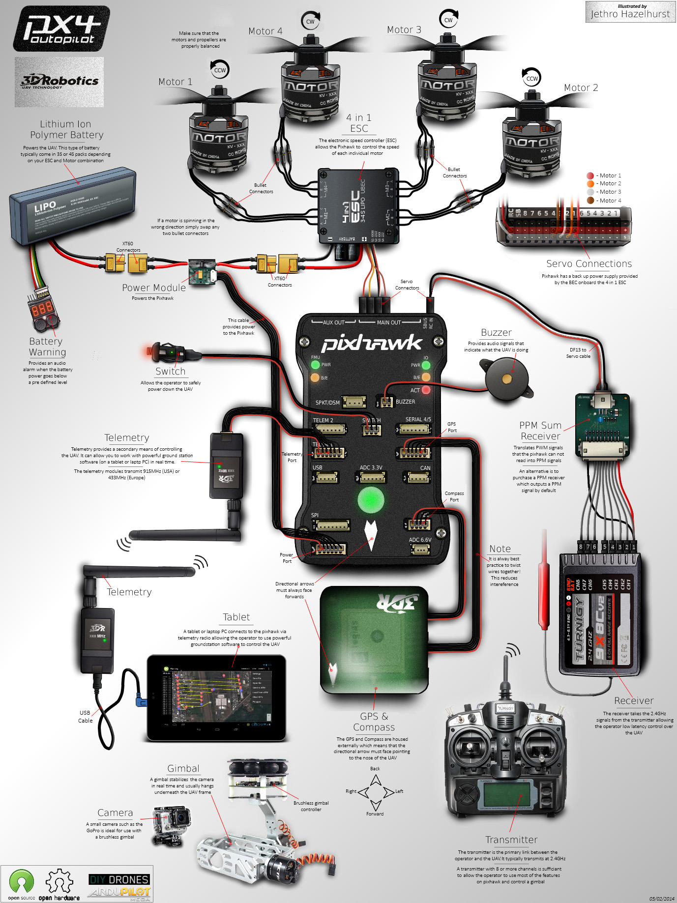

# Mamba guidance system

## Components

- Pixhawk 1
- A pair of SiK telemetry radios
- GPS with compass u-blox LEA-6H with shielding
- Hobbyking Skywalker Quattro 25Ax4 (4 in 1 ESC for 2-4S LiPo) with ubec 3A@5.25V
- Power module
- Safety switch
- Piezo buzzer

## Wiring

